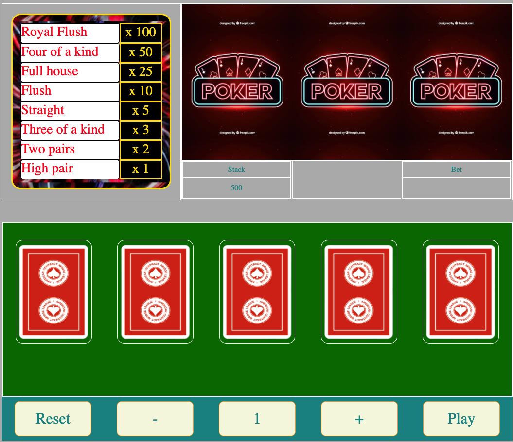

# Poker Machine

A classic single player poker slot machine

## Objective

To build a dynamic poker slot machine with the following features:
 * Placing bets as well as increasing / decreasing the amount of the bet

 

 * Able to swap up to all 5 cards 
 

 * Dynamic cashier based on bet placed and winning hand

 

 * Animated screen in case of a winning hand

 

 ## Skills and technical aspects to focus on

 * Creating a virtual deck of cards with JavaScripts 
 * Refreshing the deck of cards each round of bets
 * Using JavaScript to change the DOM content 

 ## Links

 [Poker Machine Demo](https://www.theodhorshyti.com/poker.html)